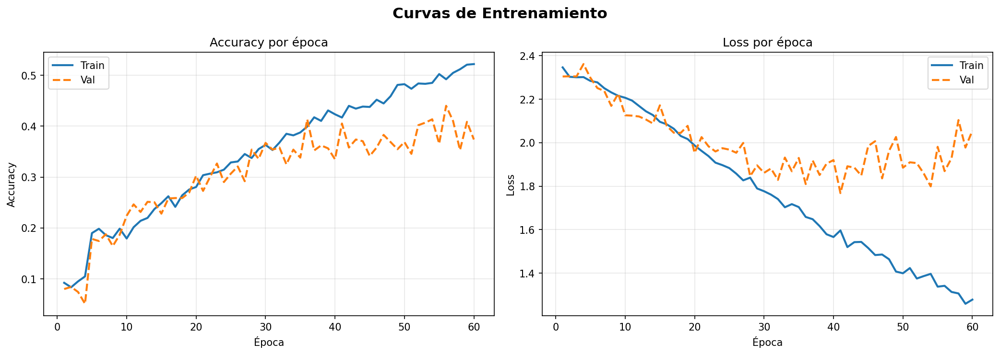
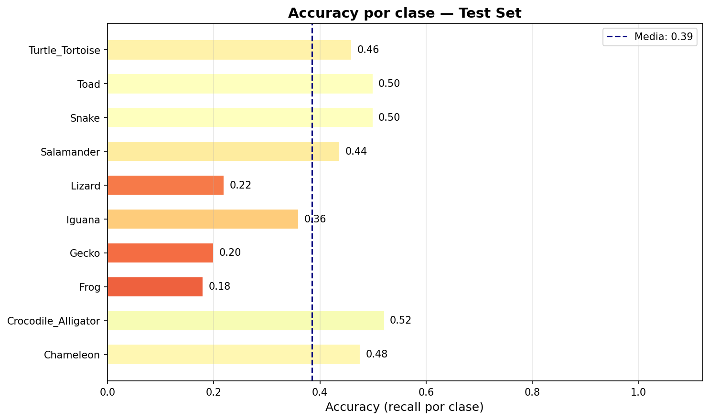

# 🦎 Clasificador de Reptiles y Anfibios (CNN + ResNet50)

Sistema de clasificación de imágenes basado en **Deep Learning** que identifica automáticamente **10 clases de reptiles y anfibios** a partir de fotografías.

El proyecto compara un modelo base basado en CNN con un modelo mejorado basado en **ResNet50**, incorporando técnicas modernas como **transfer learning**, **manejo del desbalance de clases** y **evaluación con múltiples métricas**.

---

# Clases

| Índice | Clase                 |
| ------ | --------------------- |
| 0      | Chameleon             |
| 1      | Crocodile / Alligator |
| 2      | Frog                  |
| 3      | Gecko                 |
| 4      | Iguana                |
| 5      | Lizard                |
| 6      | Salamander            |
| 7      | Snake                 |
| 8      | Toad                  |
| 9      | Turtle / Tortoise     |

---

# Dataset

Raijin. (2022). *Reptiles and Amphibians Image Dataset*. Kaggle.

* **6,045 imágenes**
* **10 clases**
* Dataset **desbalanceado**

---

## Distribución

| Clase               | Imágenes |
| ------------------- | -------- |
| Turtle_Tortoise     | 1862     |
| Crocodile_Alligator | 692      |
| Lizard              | 500      |
| Snake               | 500      |
| Frog                | 499      |
| Iguana              | 499      |
| Toad                | 497      |
| Salamander          | 484      |
| Gecko               | 302      |
| Chameleon           | 210      |

---

# División del Dataset (70 / 20 / 10)

Se utilizó `train_test_split` con **stratify** para preservar la proporción de clases:

```python
train_df, temp_df = train_test_split(df, test_size=0.3, stratify=df['clase'], random_state=42)
val_df, test_df = train_test_split(temp_df, test_size=0.333, stratify=temp_df['clase'], random_state=42)
```

| Split | Imágenes | Porcentaje |
|-------|----------|------------|
| Train | 4,230 | 70% |
| Validación | 1,209 | 20% |
| Test | 605 | 10% |

---

# Preprocesamiento

* Redimensionamiento: **224×224**
* Normalización:

```python
rescale = 1./255
```

---

# Data Augmentation

### Data Augmentation

El augmentation se aplica **únicamente al conjunto de train**. Val y test solo reciben normalización (`rescale=1./255`)  tal como se sugiere en Lv et al. (2022).

| Transformación | Valor |
|----------------|-------|
| `zoom_range` | 0.17 |
| `rotation_range` | 7° |
| `width_shift_range` | 0.17 |
| `height_shift_range` | 0.17 |
| `horizontal_flip` | True |

---

#  Manejo del Desbalance

Se utilizó:

```python
class_weight = compute_class_weight(...)
```

**Electronics (2023)**
https://www.mdpi.com/2079-9292/12/21/4423

Este trabajo demuestra que:

* El desbalance afecta negativamente el desempeño del modelo
* Las técnicas como `class_weight` mejoran el aprendizaje en clases minoritarias
* Se evita sesgo hacia clases dominantes

---

# Modelo Base

Arquitectura CNN inspirada en:

Lv, Q., Zhang, S., & Wang, Y. (2022)

```text
Input (224×224×3)

Conv2D(32) → MaxPool
Conv2D(64) → MaxPool
Conv2D(128) → MaxPool

Flatten
Dense(256)
Dense(128)
Dense(64)

Softmax
```

Consiste en una CNN mejorada sobre VggNet compuesta por **tres capas convolucionales con kernels decrecientes**, seguidas de **tres capas fully connected** y un clasificador **Softmax**. El paper demuestra que esta configuración supera a LeNet, AlexNet y VggNet estándar en accuracy de clasificación de imágenes.


**Decisiones de diseño basadas en el paper:**

- **3 capas convolucionales + 3 capas FC:** Configuración que el paper identifica como óptima; más capas llevan a overfitting, menos capas degradan la extracción de features.
- **Activación ReLU:** Evita el problema de gradient vanishing que afecta a sigmoides en redes profundas (Lv et al., 2022, Sec. 4.2, Eq. 2).
- **MaxPooling:** El paper recomienda explícitamente *max pooling sampling* para reducir el feature map y evitar overfitting.
- **Softmax en la salida:** Clasificador supervisado que produce probabilidades por clase (Lv et al., 2022, Sec. 3.1, Eq. 1).
- **Data augmentation:** El paper señala que extender el dataset mediante aumentación mejora la capacidad de generalización del modelo (Sec. 4.1).

---

## Resultados Modelo Base

### Métricas globales (época 60)

| Métrica | Train | Validación | Test |
|---------|-------|------------|------|
| Accuracy | 0.52 | 0.38 | **0.41** |
| Loss | 1.28 | 2.00 | — |


### Curvas de Entrenamiento


### Accuracy por Clase


### Problema

Se observa **overfitting**, consistente con lo reportado en modelos CNN poco profundos.

Las curvas de entrenamiento revelan un caso claro de **overfitting**. El accuracy de train sigue subiendo hasta 0.52 al final de las 60 épocas mientras que el de validación se estanca y oscila alrededor de 0.38 desde la época 30. La loss de train cae de forma continua hasta 1.28, pero la loss de validación deja de mejorar cerca de la época 20 y empieza a oscilar entre 1.8 y 2.1. Esta brecha creciente entre train y val indica que el modelo memorizó los datos de entrenamiento en lugar de generalizar.

En cuanto al rendimiento por clase, **Salamander** (0.44), **Crocodile_Alligator** (0.52) y **Toad/Snake** (0.50) son las clases mejor clasificadas. Las más problemáticas son **Frog** (0.18), **Gecko** (0.20) y **Lizard** (0.22), probablemente por su similitud visual con otras clases (Iguana, Toad, Salamander respectivamente). Es interesante notar que **Chameleon**, a pesar de ser la clase con menos imágenes (21 en test), alcanza un recall de 0.48, lo que sugiere que `class_weight` cumplió su función en las clases minoritarias.

---

# Modelo Mejorado: ResNet50

Basado en:

He, K., Zhang, X., Ren, S., & Sun, J. (2016)
Deep Residual Learning for Image Recognition

https://ieeexplore.ieee.org/document/7780459

---

## Arquitectura

```text
ResNet50 (preentrenado en ImageNet)

GlobalAveragePooling
BatchNormalization
Dense(128, relu)
Dropout(0.4)

Softmax
```
El modelo mejorado se basa en ResNet50, una arquitectura profunda que introduce el concepto de bloques residuales (residual blocks). Estos bloques permiten que la red aprenda funciones residuales mediante conexiones directas (skip connections), resolviendo el problema de degradación que ocurre en redes profundas.

**Decisiones de diseño basadas en el paper:**

- **Uso de ResNet50 preentrenado (Transfer Learning):** Se utiliza un modelo entrenado en ImageNet para aprovechar features visuales generales aprendidos previamente, reduciendo la necesidad de grandes datasets.
- **Congelamiento de capas convolucionales:** Se mantienen los pesos originales de ResNet para evitar sobreajuste, permitiendo que el modelo actúe como extractor de características..
- **GlobalAveragePooling en lugar de Flatten:** Reduce el número de parámetros y evita overfitting, manteniendo información espacial relevante.
- **Batch Normalization:** Estabiliza el entrenamiento y mejora la convergencia, reduciendo el problema de internal covariate shift.
- **Capa Dense + Dropout:** Permite adaptar las features al problema específico mientras se reduce el overfitting.
- **Softmax en la salida:** Produce probabilidades por clase para clasificación multiclase, consistente con el enfoque supervisado del paper.
---

## Configuración

* Optimizer: Adam
* Loss: categorical_crossentropy
* Epochs: 30

---

# Métricas de Evaluación

Se utilizaron múltiples métricas diferentes al paper, se creyó que no eran las más óptimas por lo que se decidió buscar las mejores:

* Accuracy
* Precision
* Recall
* F1-score

---

Basado en:

**Scientific Reports (2024)**
https://www.nature.com/articles/s41598-024-56706-x

Este estudio establece que:

* Accuracy es insuficiente en datasets desbalanceados
* Precision y Recall permiten evaluar el rendimiento por clase
* F1-score proporciona una medida balanceada

---

#  Resultados (ResNet50)

## Métricas Globales

| Métrica   | Valor      |
| --------- | ---------- |
| Accuracy  | **0.8512** |
| Precision | **0.8524** |
| Recall    | **0.8512** |
| F1-score  | **0.8493** |

---

##  Promedios

| Tipo         | Valor |
| ------------ | ----- |
| Macro avg    | 0.80  |
| Weighted avg | 0.85  |

---

##  Desempeño por Clase

El modelo obtiene mejor desempeño en clases visualmente distintivas (*Turtle_Tortoise*, *Crocodile_Alligator*), y menor desempeño en clases con alta similitud visual (*Gecko*, *Lizard*).

---

# Análisis

El modelo mejora significativamente respecto al baseline:

* **0.41 → 0.85 accuracy**

Esto valida el uso de:

* Transfer learning
* Arquitecturas profundas
* Métricas robustas

---

# Limitaciones

* Similitud visual entre clases
* Dataset desbalanceado
* Sin fine-tuning completo

---

# Trabajo Futuro

* Fine-tuning de ResNet
* EfficientNet / Vision Transformers
* Más datos

---

## Requisitos

```
tensorflow
keras
scikit-learn
pandas
numpy
matplotlib
seaborn
```

Instalación:

```bash
pip install tensorflow scikit-learn pandas numpy matplotlib seaborn
```

---

# Uso

```bash
python index.py --image assets/imagen.jpg
```

---

# Referencias

[1] Lv, Q., Zhang, S., & Wang, Y. (2022).
Deep learning model of image classification using machine learning.
Advances in Multimedia, 2022.
https://doi.org/10.1155/2022/3351256

[2] He, K., Zhang, X., Ren, S., & Sun, J. (2016).
Deep Residual Learning for Image Recognition.
CVPR.
https://ieeexplore.ieee.org/document/7780459

[3] Al-Masni, M. A. et al. (2023).
Addressing Class Imbalance in Deep Learning.
Electronics, 12(21), 4423.
https://www.mdpi.com/2079-9292/12/21/4423

[4] Chicco, D., & Jurman, G. (2024).
Evaluation metrics for machine learning.
Scientific Reports.
https://www.nature.com/articles/s41598-024-56706-x

[5] Raijin. (2022).
Reptiles and Amphibians Dataset.
Kaggle.
https://www.kaggle.com/datasets/vencerlanz09/reptiles-and-amphibians-image-dataset

---
